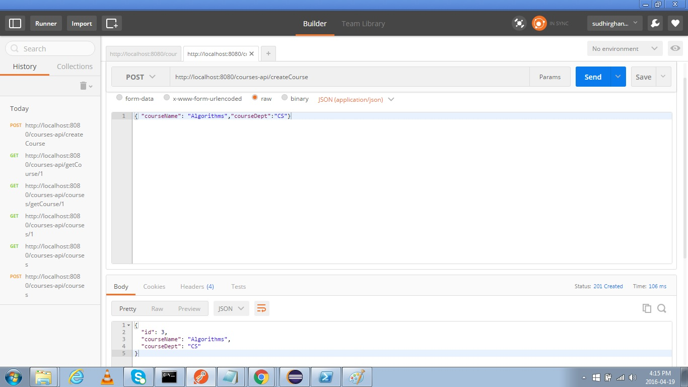

# Course API
##Overview
The repository contains working code for 2 questions part of the coding challenge.

##1. "Get Duplicates" function that accepts a String and returns a String of characters that are duplicated

To implement this I have developed a JAVA Class, which uses java.util.Scanner() to take user input.
The String will be converted into an array of characters and will be sent as parameters to "getDuplicates()" method.
In this method, each character will be added into a HashMap with a character key.
If the character is already seen in the string, then it would be present in the HashMap already in which case I append this character to a result string.
After iterating over all the chatacters, the result string will contain set of characters that are duplicated.

```sh
Input:AABCCDd
Output: AC
```

##2. REST API with CRUD Operations

I have developed a simple REST API which creates, updates, deletes and lists all courses in a website
It has the following features
* i.  Spring JPA repository to persist "course" entities. HSQLDB is used as a database.
* ii.  Transaction Management for all the web-service methods.
* iii. Cache Management Support
* iv.  Unit test cases to test all the webservice methods.
* v. Embedded Apache Tomcat server provided by Spring-boot

Tools/Libraries Used:
* 1. JAVA (JDK 1.8)
* 2. Spring-boot framework
* 3. Maven
* 4. JUnit
* 5. Google Guava
* 6. JPA
* 7. google chrome Postman app to test webservice URL's

To run the project, we can either build the package and run the jar using
```sh
mvn clean package
``` 
or run directly
```sh
mvn clean spring-boot:run
```

## API Services
* 1. LIST ALL COURSES
```sh
GET: '/courses-api/courses'

Retrieves all the courses available in the repository
Parameters: None
```
* 2. LIST A SPECIFIC COURSE
```sh
GET: '/courses-api/getCourse/{id}'

Retrieves the specific course identified by the given specified identifier
```
* 3. CREATE A COURSE
```sh
POST: '/courses-api/createCourse'

Creates a course and adds it into the repository. Course ID will be generated automatically.
Parameters: 'courseName' and 'courseDept'
```
* 4. UPDATE A COURSE
```sh
PUT: '/courses-api/updateCourse'

Updates an existing course in the repository. Course ID of the course to be updated needs to be provided as a request parameter.
Parameters: 'id', 'courseName' and 'courseDept'
```
* 5. DELETE A COURSE
```sh
DELETE: '/courses-api/deleteCourse/{id}

Deletes an existing course from the repository. Course ID of the course has to be provided in the URL as a Path variable.
```

##Screen Shots
* 1 '/courses-api/courses'


* 2 '/courses-api/getCourse/1'


* 3 '/courses-api/createCourse'



* 4 '/courses-api/updateCourse'


* 5 '/courses-api/deleteCourse'


##3. About the Code

The source code is under the folder src/main/java and consists of 5 packages.
* i.    com.Test.CourseAPI - This package consists of the main Application class.
* ii.   com.Test.CourseAPI.model - This package consists of the model(entity) class
* iii.  com.Test.CourseAPI.repository - This package consists of JPA persistence repository interface
* iv.   com.Test.CourseAPI.service - This package consists of the Service Interface and the Implementation bean of the service. Dependency Injection is used to get the instance of the Service Interface
* v.    com.Test.CourseAPI.web - This package consists of the Controller class having the request handler methods.

The testing code is under the folder src/test/java and contains 1 package
* i.  com.Test.CourseAPI - This package consists of two class. One is an abstract class that can be used as base class for all the test classes that can be used in the project. The intuition here is to keep the common testing logic used across all the test classes.
It also contains the Test Implementation class which consists of 8 test methods to test all the web service functionality

* ii. Other files.
/src/main/resources/config/application.properties- This properties file contains properties to configure hibernate JPA and Spring Datasource
/src/main/resources/data/hsqldb - This path contains two scripts to create and load the schema of the repository


